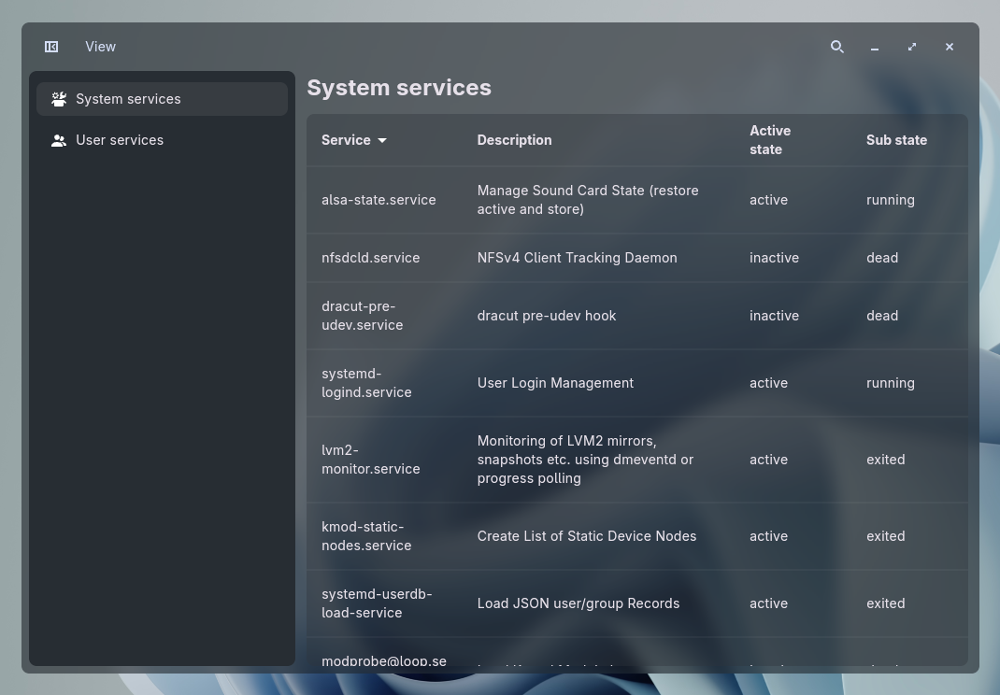
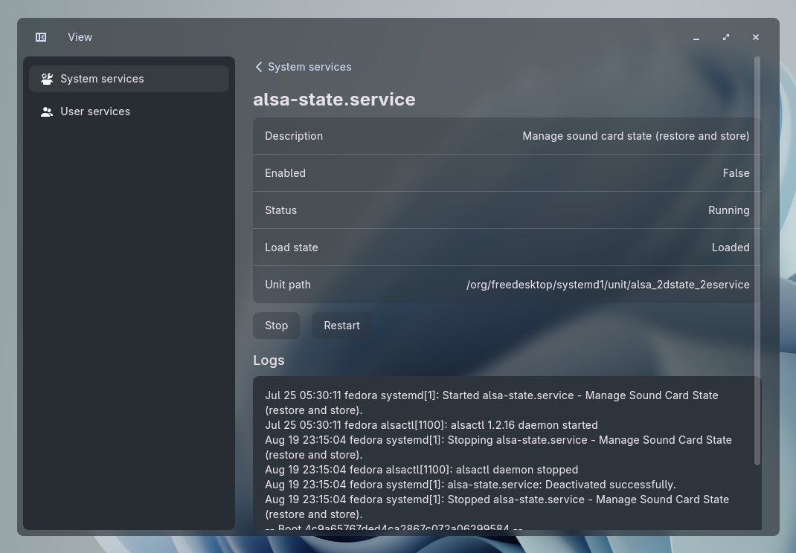

# CTL Dash App Redesign

A UI/UX redesign concept for the CTL Dash, a systemd service manager app for the COSMIC desktop.

The goal of this redesign is to improve information hierarchy, visual consistency, and usability while following the COSMIC design language.

## Preview

  
  

