# Minimon Applet Redesign

A UI/UX redesign concept for the Minimon hardware monitor applet for the COSMIC desktop.

The goal of this redesign is to improve information hierarchy, visual consistency, and usability while following the COSMIC design language.

## Preview

  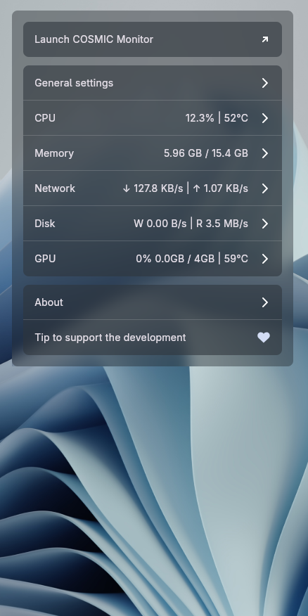
  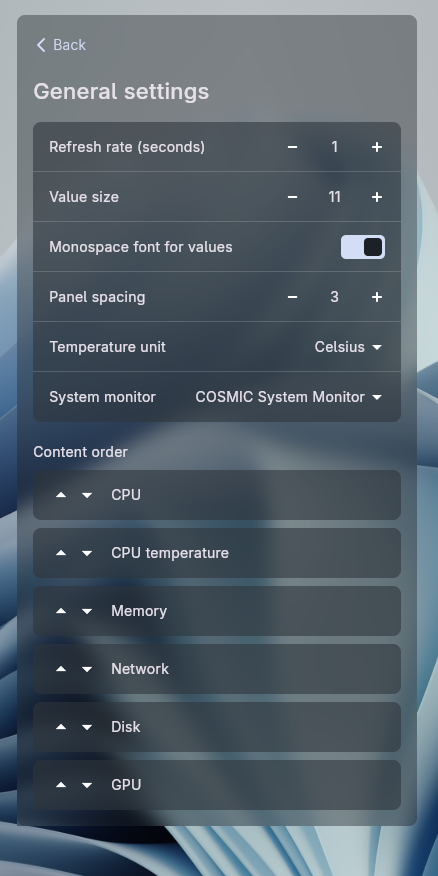
  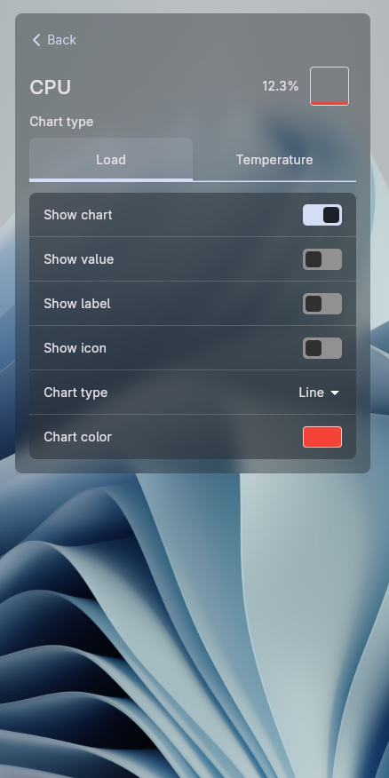
  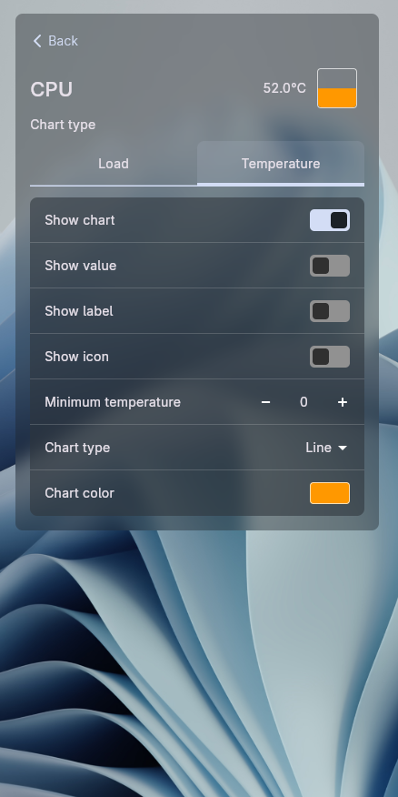
  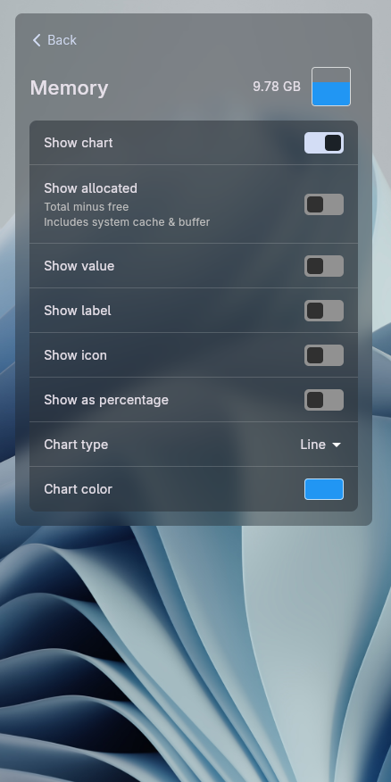
  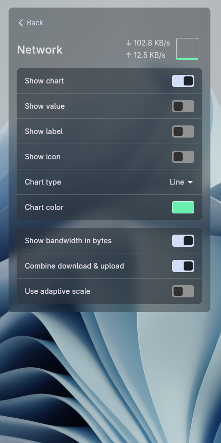
  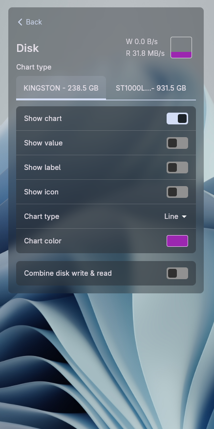
  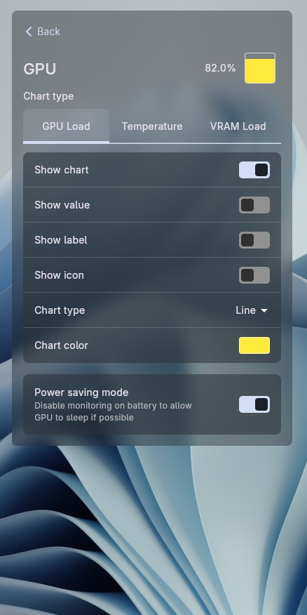
  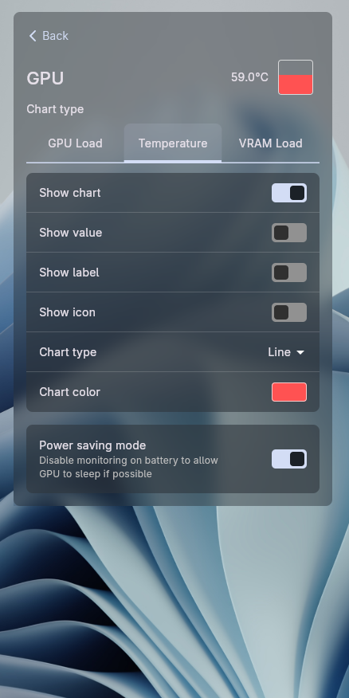
  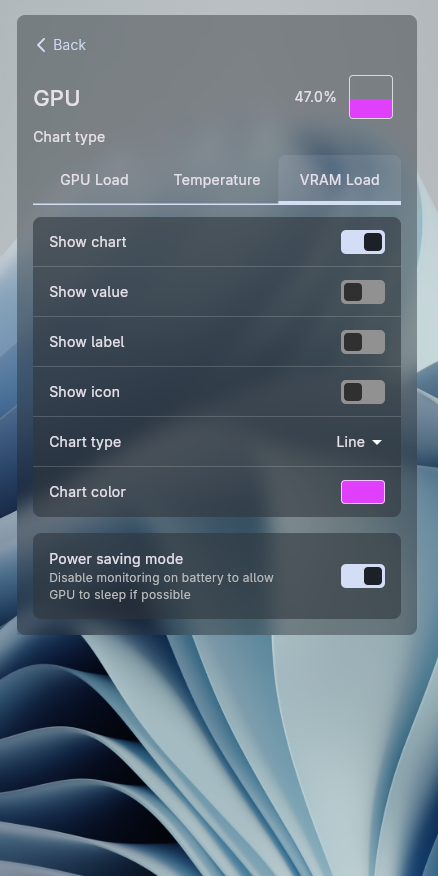
  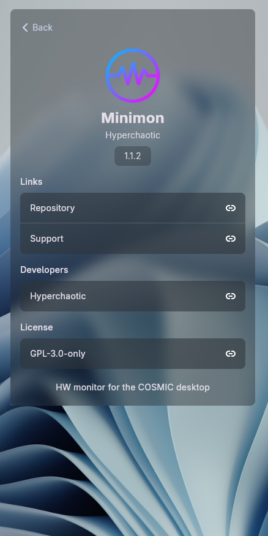

## Design Goals
- Maintain consistency with the COSMIC desktop design language.
- Present hardware information in a clear and organized layout.
- Improve readability and reduce visual clutter.
- Provide quick access to commonly used controls.
- Make better use of available space while keeping the interface compact.

## Status
This repository contains design mockups only. It is **not** an implementation of the applet.
