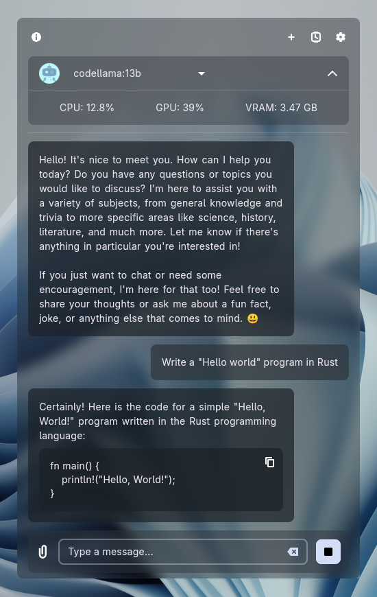
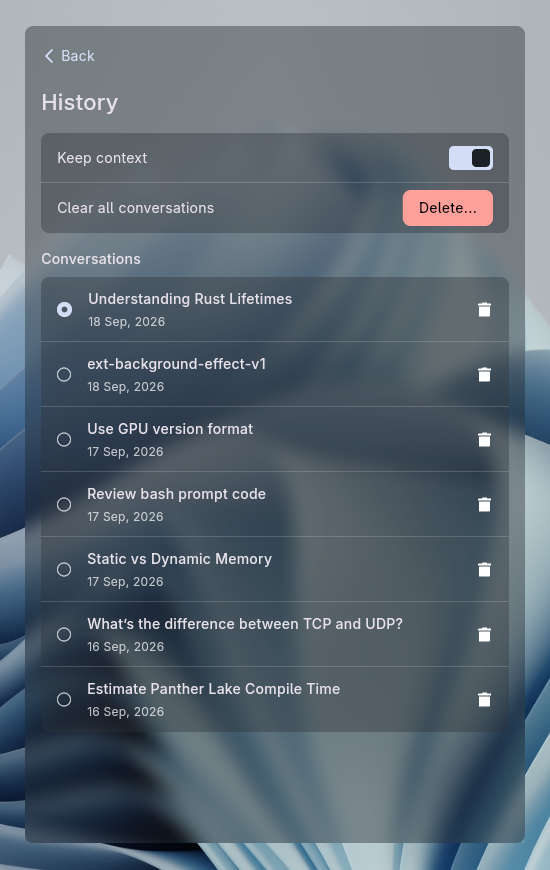
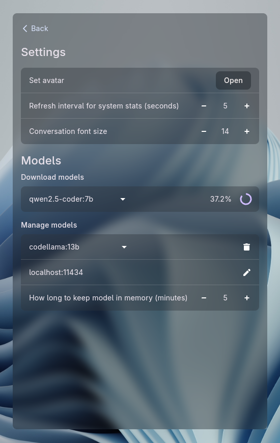
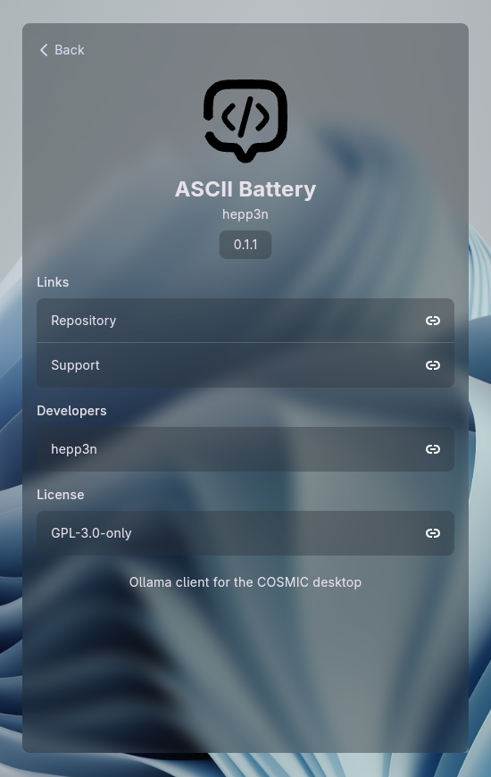

# Ollama Applet Redesign

A UI/UX redesign concept for the Ollama, An Ollama client applet for the COSMIC desktop.

The goal of this redesign is to improve information hierarchy, visual consistency, and usability while following the COSMIC design language.

## Preview

  
  
  
  

